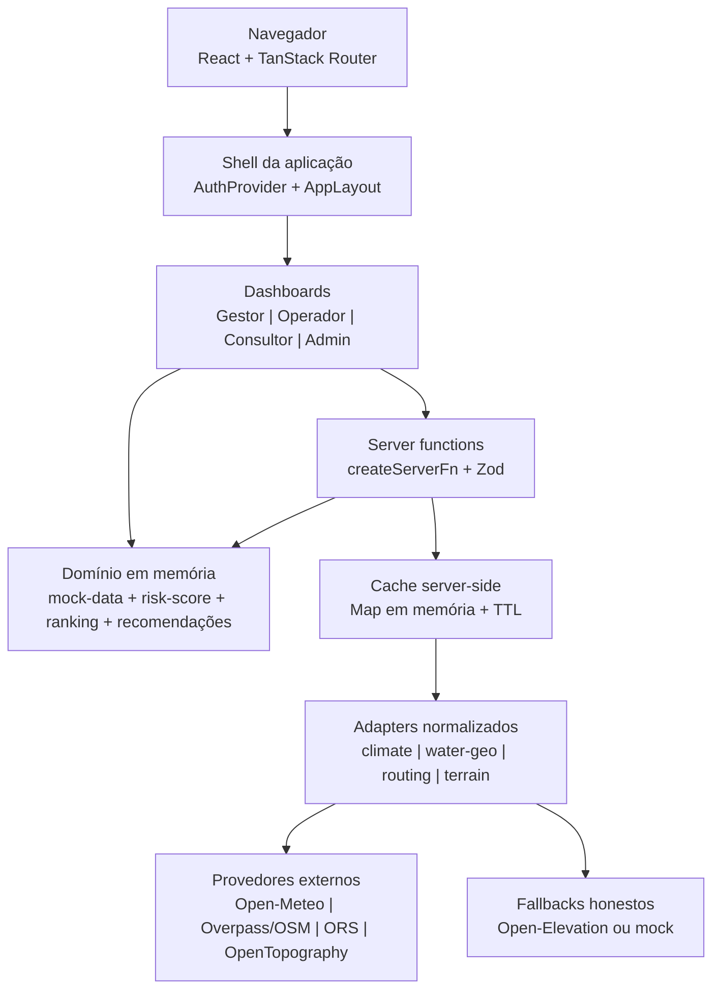
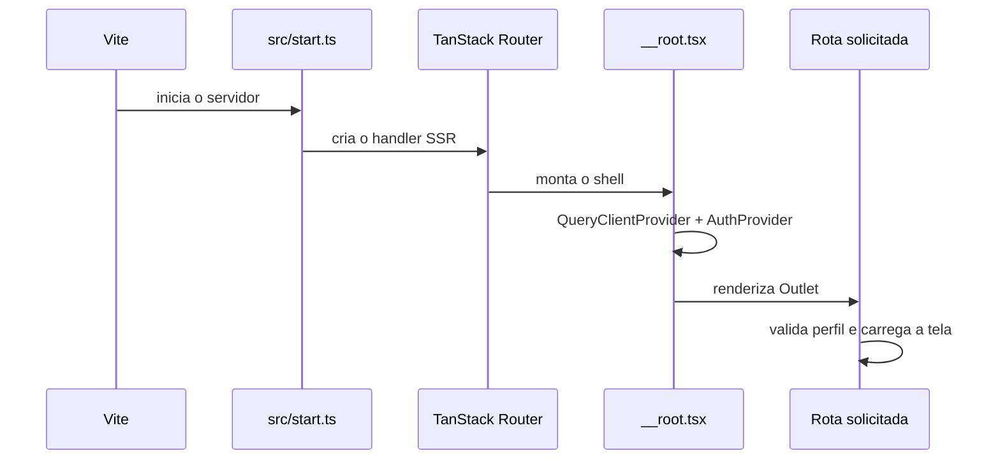
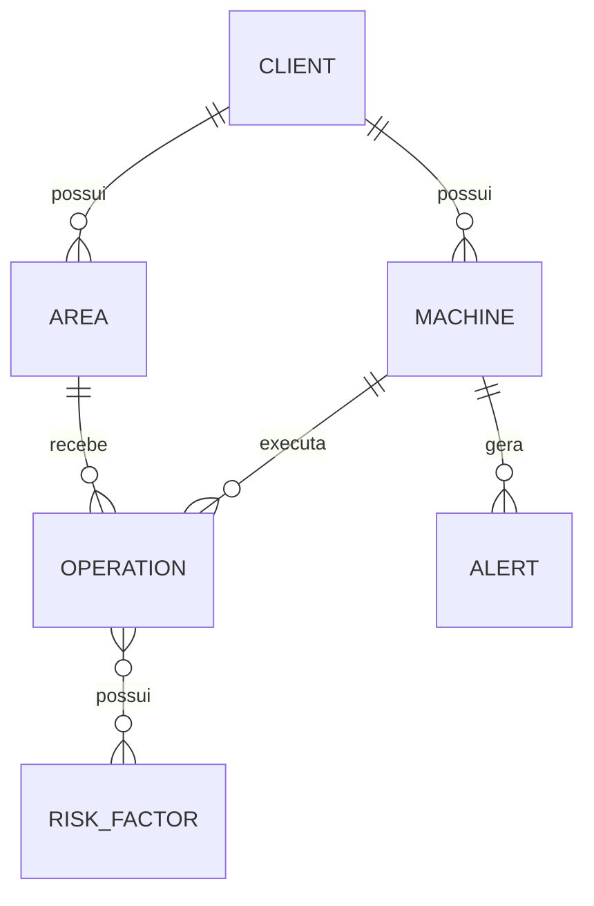
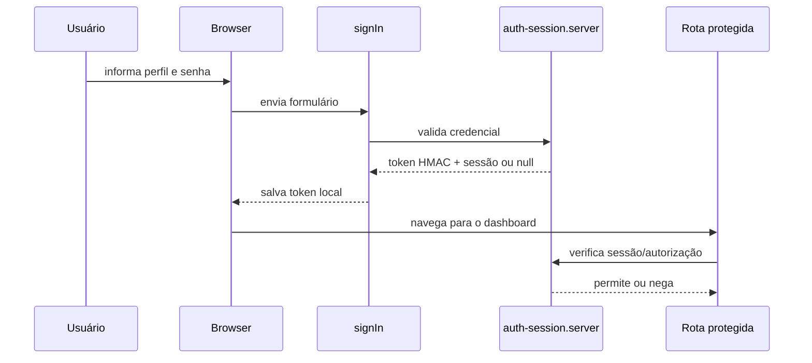
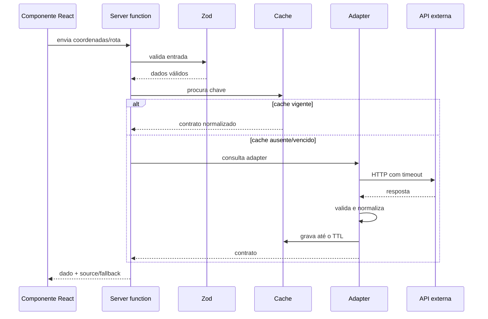
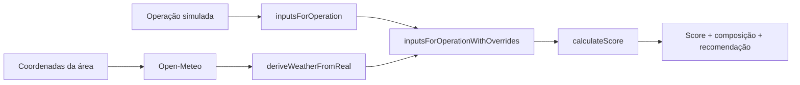

# AgroGuard Vision (AgroRisk)

## Documentação da solução

**Versão do documento:** estado do código verificado em 25 de agosto de 2026  
**Idioma:** português  
**Escopo:** MVP web de monitoramento de risco agrícola

Este documento descreve o sistema como ele existe hoje. Ele distingue dados simulados, dados obtidos de provedores externos, fallbacks e funcionalidades que ainda são apenas roadmap. Isso é importante porque o projeto começou como um protótipo visual, mas agora já possui uma camada server-side para consultar clima, hidrografia, rotas e terreno.

## 1. Visão geral

O AgroGuard Vision é uma aplicação web com quatro visões de uso:

- **Gestor:** acompanha a frota, clientes, áreas, ranking de risco, clima e recomendações.
- **Operador:** consulta a operação atual, o equipamento, o score, alertas, recomendações e contexto geográfico.
- **Consultor/Corretor:** consolida o risco de um cliente e transforma os fatores técnicos em uma explicação operacional.
- **Admin/Sompo:** visualiza a base consolidada de clientes, máquinas, áreas, operações, scores, recomendações e alertas.

O score continua sendo determinístico e transparente. As entidades principais e a maior parte dos cenários são simulados em memória. Quando uma fonte externa funciona, o sistema usa seus valores para substituir os inputs de clima e proximidade de água da operação correspondente. A falha de uma fonte não impede a tela de carregar: o adapter retorna um fallback explicitamente marcado.

### O que a solução não é

O código atual ainda não é uma plataforma de produção completa. Não há:

- banco de dados ou ORM;
- cadastro persistente de usuários;
- telemetria, sensores ou GPS em tempo real;
- fila, mensageria ou processamento assíncrono;
- IA generativa;
- métricas, tracing ou logs centralizados;
- suíte automatizada de testes identificada;
- mini-mapa com a geometria real da rota;
- contagem regressiva ou tempo restante da operação baseado na rota real.

## 2. Arquitetura em camadas



### Responsabilidades por camada

| Camada | Responsabilidade | Localização principal |
|---|---|---|
| Apresentação | Layout, navegação, cards, tabelas, diálogos e estados visuais | `src/components/`, `src/routes/`, `src/styles.css` |
| Rotas | Entrada das telas e proteção por perfil | `src/routes/*.tsx`, `src/components/require-profile.tsx` |
| Estado de sessão | Login, token de sessão, perfil atual e logout | `src/lib/auth.tsx`, `src/lib/auth.functions.ts` |
| Domínio | Entidades simuladas, score, rankings, alertas e recomendações | `src/lib/mock-data.ts`, `risk-score.ts`, `ranking.ts`, `recommendations.ts`, `profile-alerts.ts` |
| Borda server-side | Validação das entradas e chamada aos adapters | `src/lib/api/*.functions.ts` |
| Integrações | HTTP, parsing, normalização, timeout, logs e fallback | `src/lib/adapters/*.server.ts` |
| Configuração | Leitura de chaves apenas no servidor | `src/lib/config.server.ts` |
| Cache | Reuso temporário de respostas externas | `src/lib/cache.server.ts` |

Não existe um backend separado. As funções `createServerFn` do TanStack Start são a fronteira entre o React e os provedores externos. Arquivos terminados em `.server.ts` devem continuar fora do bundle do navegador.

## 3. Inicialização, build e execução

### Stack

- React 19
- TanStack Router e TanStack Start com SSR
- Vite 8
- TypeScript estrito
- Tailwind CSS v4
- shadcn/ui e Radix UI
- Recharts
- Bun como gerenciador e executor preferencial

### Comandos

```bash
bun install
bun run dev
bun run build
bun run lint
bun run format
```

O workflow configurado no Replit é **Start application** e executa `bun run dev`. O servidor deve escutar em `0.0.0.0:5000`, para que o preview do Replit consiga acessá-lo. A configuração correspondente está em `.replit` e `vite.config.ts`.

### Caminho de inicialização



`src/routeTree.gen.ts` é gerado automaticamente. Não deve ser editado manualmente; a criação ou alteração de uma rota deve ser feita no arquivo da rota.

O shell raiz também fornece:

- `QueryClientProvider`;
- `AuthProvider`;
- tratamento de 404;
- error boundary com tentativa de recarregar a rota;
- `reportLovableError` quando `window.__lovableEvents` estiver disponível;
- `<HeadContent />` e `<Scripts />` para SSR.

## 4. Rotas e dashboards

| Caminho | Perfil | Objetivo |
|---|---|---|
| `/` | Público | Login/seleção de perfil |
| `/gestor` | Gestor ou Admin | Visão da frota, clientes, áreas, clima e risco |
| `/operador` | Operador ou Admin | Acompanhamento da operação atual e contexto geográfico |
| `/consultor` | Consultor ou Admin | Análise consolidada de um cliente |
| `/admin` | Admin | Visão ampla da operação da plataforma |

O `AppLayout` concentra sidebar, header, navegação por perfil, busca visual, logout e navegação por hash. A proteção de interface é feita por `RequireProfile`; a autorização importante também é validada no servidor por `authorizePath`. Esconder um link não é considerado controle de acesso suficiente.

### Gestor

Exibe KPIs de máquinas monitoradas, operações em risco, score médio e alertas críticos; rankings por equipamento e área; distribuição/evolução do risco; recomendações; alertas por perfil e filtros. A integração de clima consulta as coordenadas dos clientes/áreas e apresenta origem do dado.

O score médio e os rankings partem do domínio simulado. O clima real é aplicado nas operações associadas quando a chamada é bem-sucedida. Não se deve interpretar todo KPI da tela como medição de uma frota conectada em tempo real.

### Operador

Exibe a operação atual, máquina, score e composição de risco; alertas e recomendação prática; histórico; contexto da área; clima, hidrografia, rota, terreno/elevação e solo demonstrativo.

As coordenadas usadas hoje vêm de `src/lib/area-coordinates.ts` e são aproximadas. Portanto, os resultados geográficos representam o ponto configurado para a área, não um GPS real do equipamento.

### Consultor/Corretor

Permite selecionar ou visualizar o cliente, equipamentos de maior risco, áreas, fatores dominantes, recomendações preventivas e o bloco “Explicação para o cliente”. A linguagem é de apoio à análise; não é uma decisão automática de subscrição ou sinistro.

### Admin/Sompo

Consolida entidades e indicadores da aplicação: clientes, máquinas, áreas, operações, scores, recomendações e alertas. A tela atual é de visualização. Não existe CRUD persistente.

## 5. Domínio e dados atuais

### Fonte do domínio

`src/lib/mock-data.ts` contém as entidades usadas pelo MVP:

- usuários e perfis;
- clientes/fazendas;
- áreas;
- máquinas;
- operações;
- alertas;
- fatores de risco;
- recomendações;
- histórico.

Esses arrays são carregados no processo e não são alterados de forma persistente por uma ação do usuário. Reiniciar o workflow restaura o mesmo estado.

### Relacionamentos principais



As operações ligam área e máquina. O score da máquina usa a operação em andamento; se não houver uma em andamento, usa a última operação encontrada para aquela máquina. O histórico operacional conta alertas resolvidos da mesma máquina.

## 6. Motor de score

O motor está em `src/lib/risk-score.ts`. Ele recebe inputs discretos, calcula cada parcela, limita o total entre 0 e 100 e classifica o risco com `riskFromScore` do domínio.

### Composição

| Fator | Máximo | Regra resumida |
|---|---:|---|
| Clima | 20 | Sem chuva, chuva leve, moderada ou forte |
| Proximidade de água | 25 | Acima de 150 m, 100–150 m, 50–100 m ou abaixo de 50 m |
| Tipo de operação | 20 | Operações próximas de água recebem o maior peso |
| Histórico operacional | 15 | 0, 1, 2 ou 3+ alertas resolvidos |
| Inclinação | 20 | Leitura em graus pelo ESP32 + MPU6050: estável, atenção ou crítica |
| Condição do terreno | 10 | Normal, úmido, crítico ou baixa aderência |
| **Total** | **100** | Soma limitada a 100 |

Os limiares visuais são baixo até 40, médio de 41 a 70 e alto de 71 a 100, conforme `riskFromScore`.

### Dados simulados e overrides reais

O fluxo é:

1. `inputsForOperation` deriva os seis inputs da operação simulada.
2. O adapter de clima, quando disponível, é convertido por `deriveWeatherFromReal`.
3. O adapter de hidrografia, quando disponível, é convertido por `deriveWaterDistanceFromReal`.
4. `inputsForOperationWithOverrides` mescla os overrides sobre os inputs derivados.
5. `calculateScore` calcula e retorna total, nível, partes e fator principal.

Conversões atuais:

- precipitação atual `>= 8 mm/h` → chuva forte;
- precipitação atual `>= 2 mm/h` → chuva moderada;
- precipitação atual `> 0` → chuva leve;
- sem chuva atual, probabilidade das próximas três horas `>= 70%` → moderada e `>= 40%` → leve;
- distância nula ou superior a 150 m → acima de 150 m;
- demais faixas seguem os limites de 150, 100 e 50 m.

O restante dos fatores — tipo de operação, histórico, inclinação e terreno — ainda é derivado do domínio simulado. A inclinação aceita leitura numérica em graus e usa fallback mockado até a conexão do ESP32 + MPU6050.

### Rankings e recomendações

`ranking.ts` calcula distribuição, filtros e priorização para as visões. `recommendations.ts` gera recomendações determinísticas a partir do fator, nível, público e prioridade. `profile-alerts.ts` fornece alertas de apresentação contextualizados por perfil.

Esses módulos não consultam um modelo de IA. Qualquer futura mudança de regra deve preservar a explicabilidade: mostrar qual fator contribuiu, quantos pontos adicionou e qual ação foi recomendada.

## 7. APIs server-side e contratos

Cada função recebe JSON validado por Zod, chama um adapter e devolve um contrato normalizado. O frontend não recebe o shape bruto dos provedores.

| Função | Entrada validada | Saída |
|---|---|---|
| `getWeather` | latitude e longitude válidas | `WeatherData` |
| `getWaterFeatures` | latitude, longitude e raio opcional entre 100 e 50.000 m | `WaterGeoData` |
| `getRouting` | origem e destino com latitude/longitude válidas | `RouteData` |
| `getElevation` | latitude e longitude válidas | `ElevationData` |

As definições dos contratos estão em `src/lib/external-data.types.ts`.

### `WeatherData`

Contém origem, coordenadas, horário de coleta, condição atual, temperatura, umidade, precipitação, vento e previsão horária das próximas seis horas. A origem é `open-meteo` ou `mock`.

### `WaterGeoData`

Contém origem, servidor usado, indicação de fallback, ponto consultado, raio, horário, feições, distância mínima e nome da feição mais próxima. A origem é `overpass` ou `mock`.

### `RouteData`

Contém origem, destino, rota principal e rota alternativa opcional. Cada rota tem distância, duração, rótulos legíveis e passos. A origem é `openrouteservice` ou `mock`.

### `ElevationData`

Contém elevação, declividade quando calculada, classe/rótulo de inclinação e pontos próximos. A origem pode ser `opentopography`, `open-elevation` ou `mock`.

## 8. Integrações externas

| Fonte | Uso | Chave | TTL | Fallback |
|---|---|---|---:|---|
| Open-Meteo | Clima atual e previsão horária | Não | 10 min | Clima mock |
| Overpass / OpenStreetMap | Rios, córregos, lagos e outras feições | Não | 30 min | Hidrografia mock |
| openrouteservice | Distância, duração, passos e alternativa de rota | `ORS_API_KEY` | 15 min | Rota mock |
| OpenTopography | Elevação e grade para declividade | `OPENTOPO_API_KEY` | 1 h | Open-Elevation e depois mock |
| SoilGrids | Demonstração visual de solo | Não usado | — | Conteúdo demonstrativo |

Todos os adapters retornam o contrato interno mesmo quando há erro. O campo `source` é a referência para a UI diferenciar conexão real e fallback.

### Clima — Open-Meteo

O adapter `climate.server.ts` consulta o serviço por coordenadas, interpreta códigos WMO, normaliza direção do vento e seleciona as próximas seis horas. Não depende de chave. Erros de rede, HTTP ou parsing resultam em `source: "mock"` e são registrados no servidor.

### Hidrografia — Overpass

O adapter `water-geo.server.ts` consulta OSM por uma query Overpass em um raio geográfico e calcula a distância aproximada por Haversine.

Ordem de servidores:

1. `overpass-api.de`;
2. `overpass.kumi.systems`;
3. `overpass.private.coffee`.

Cada tentativa usa POST com:

- `User-Agent`;
- `Accept: application/json`;
- `Content-Type: application/x-www-form-urlencoded`.

HTTP 406, 429, respostas 5xx e timeout permitem tentar o próximo servidor. A resposta precisa ser JSON válido e conter a estrutura esperada de elementos; caso todas as tentativas falhem, o resultado é o mock final. Overpass não requer API key.

O contrato já preserva `serverUsed` e `usedFallbackServer`. A interface atual identifica a origem como Overpass quando qualquer servidor retorna sucesso, mas ainda apresenta o rótulo institucional do provedor em vez de destacar visualmente qual servidor alternativo respondeu. Isso é uma oportunidade de melhoria, não um motivo para tratar a resposta como mock.

### Rotas — openrouteservice

O adapter `routing.server.ts` faz uma chamada ao openrouteservice usando o perfil `driving-car`. O perfil de veículos pesados foi descartado porque não encontrava pontos roteáveis nas coordenadas rurais utilizadas no MVP.

O resultado é convertido para distância, duração, passos e rota alternativa. Erros ou ausência de chave resultam na rota mock e no estado de configuração pendente na interface. As coordenadas ainda são aproximadas e não representam a posição live de uma máquina.

### Terreno — OpenTopography

O adapter `terrain.server.ts` usa o dataset SRTMGL3 e solicita `AAIGrid`. Essa escolha é necessária porque a resposta JSON do provedor podia chegar como conteúdo binário em vez de uma estrutura JSON utilizável.

O parser lê a grade ASCII para extrair elevação e calcular declividade. Se OpenTopography falhar, o adapter tenta Open-Elevation e, se necessário, retorna o mock. `open-elevation` é uma origem externa de fallback; não deve ser confundida com OpenTopography.

## 9. Cache

O cache é implementado por `src/lib/cache.server.ts` com `Map` em memória, chave por parâmetros da consulta, horário de expiração e limpeza de entradas vencidas.

Características:

- existe apenas no processo atual;
- não é compartilhado entre instâncias;
- é perdido quando o workflow reinicia;
- não substitui um cache distribuído;
- evita chamadas repetidas dentro do TTL;
- não grava respostas em banco ou arquivo.

### Política

| Dados | TTL | Consequência |
|---|---:|---|
| Clima | 10 min | Pode ficar desatualizado dentro da janela |
| Hidrografia | 30 min | Feições geográficas mudam pouco |
| Rota | 15 min | Duração não é tráfego em tempo real |
| Terreno | 1 h | Elevação/declividade são relativamente estáveis |

Ao adicionar um novo parâmetro que altere o resultado de um adapter, a chave do cache também deve incluir esse parâmetro. Para produção com múltiplos processos, substituir o `Map` por um cache compartilhado e definir uma política de invalidação.

## 10. Autenticação e autorização

### Estado atual

O login é uma simulação server-side em `auth-session.server.ts`:

- os quatro perfis têm credenciais fixas no código;
- o servidor cria um token com payload Base64URL;
- a assinatura é HMAC-SHA-256;
- a expiração padrão é de 12 horas;
- o segredo é lido de `AUTH_SESSION_SECRET`;
- há um fallback de segredo de desenvolvimento se a variável não existir;
- as permissões são listas fixas de rotas por perfil;
- Admin pode acessar as quatro visões.

`auth.functions.ts` valida as entradas com Zod e expõe as operações de login/verificação/autorização. No cliente, `auth.tsx` mantém o token em `localStorage`, carrega o perfil e controla o redirecionamento.

### Limitações de segurança

Esta autenticação é adequada apenas para demonstração controlada. Ela não fornece:

- usuários persistentes;
- hash de senha armazenado em banco;
- recuperação ou troca de senha;
- revogação durável de sessão;
- rotação de chaves;
- cookies `HttpOnly` e `SameSite`;
- MFA;
- auditoria;
- rate limiting de login;
- gestão de organizações/tenant;
- autorização por recurso individual.

Para produção, migrar para um provedor de identidade ou implementar uma sessão persistente com cookies seguros, armazenamento de usuários, expiração/revogação e trilha de auditoria. Não usar o segredo de desenvolvimento em ambientes publicados.

## 11. Segurança operacional

Regras que devem ser preservadas:

1. Nunca colocar `ORS_API_KEY`, `OPENTOPO_API_KEY` ou `AUTH_SESSION_SECRET` em código do frontend.
2. Nunca retornar uma chave dentro de `WeatherData`, `RouteData`, logs de resposta ou mensagens de erro.
3. Ler variáveis externas somente em módulos server-side.
4. Validar latitude, longitude, raio e demais entradas antes de acessar APIs.
5. Manter timeouts e fallbacks para não prender uma requisição web indefinidamente.
6. Não registrar payloads que possam conter credenciais.
7. Tratar o conteúdo externo como não confiável: validar status, tipo de conteúdo e shape antes de usar.
8. Em produção, trocar as credenciais demo e remover o fallback silencioso de segredo.
9. Evitar expor detalhes internos de exceções na tela; os detalhes devem ficar nos logs server-side.

As chaves são configuradas como Secrets do Replit. O nome da variável é documentado; seu valor nunca deve ser versionado ou colocado neste documento.

## 12. Configuração do Replit

### Variáveis esperadas

| Nome | Obrigatória para | Efeito quando ausente |
|---|---|---|
| `ORS_API_KEY` | Rotas reais | Rota mock e indicação de configuração pendente |
| `OPENTOPO_API_KEY` | OpenTopography | Tenta Open-Elevation; depois terreno mock |
| `AUTH_SESSION_SECRET` | Assinatura de sessão | Usa segredo de desenvolvimento, inadequado para produção |

Open-Meteo e Overpass são consultados sem chave. Não criar uma variável fictícia de API para Overpass.

### Workflow

O workflow **Start application** deve permanecer único e executar `bun run dev`. Se o preview ficar vazio após uma alteração de configuração, reiniciar o workflow e conferir se ele abriu a porta 5000. O servidor deve usar `0.0.0.0`, não `localhost` nem IPv6 `::`.

O script `scripts/post-merge.sh` instala dependências e executa uma verificação TypeScript. Atualmente ele ainda aceita falhas da verificação com `|| true`; isso evita bloquear o pós-merge, mas também pode mascarar regressões. A evolução recomendada é tornar a validação explícita e corrigir os erros antes de remover a tolerância.

## 13. Tratamento de erro e observabilidade

### No navegador

- error boundary raiz oferece “tentar novamente”;
- erro de rota pode voltar para a home;
- cada seção externa informa se a origem é real, fallback do provedor, configuração pendente ou demonstração;
- a UI não deve chamar um mock de “dado real”.

### No servidor

- adapters registram `console.info`, `console.warn` e `console.error`;
- erros de provedor são capturados por integração;
- `error-capture.ts` mantém uma captura temporária em memória;
- `error-page.ts` produz uma página de erro SSR;
- `lovable-error-reporting.ts` encaminha eventos opcionais para `window.__lovableEvents`.

### Lacunas atuais

Não há health check, métricas de latência/erro por provedor, tracing, correlação de requisições, agregação de logs, alerta operacional, persistência de auditoria ou teste automatizado identificado. Antes de operar com usuários reais, adicionar pelo menos:

- endpoint de health/readiness sem revelar segredos;
- métricas de sucesso, fallback, timeout e latência por adapter;
- logs estruturados com request id;
- monitoramento de disponibilidade dos provedores;
- testes unitários do score e dos parsers;
- testes de contrato para respostas externas.

## 14. Fluxos importantes

### Login e proteção de rota



### Consulta de dado externo



### Aplicação do clima real ao score



## 15. Guia para alterações futuras

### Adicionar ou alterar uma integração

1. Defina ou atualize o contrato em `external-data.types.ts`.
2. Crie/edite um adapter server-only.
3. Valide entrada, status HTTP, content type e shape da resposta.
4. Normalize para o contrato interno; não deixe o shape do provedor vazar.
5. Adicione timeout, logs sem segredos e fallback explicitamente marcado.
6. Defina a chave e o TTL do cache.
7. Exponha o adapter por uma `createServerFn` com Zod.
8. Consuma a função a partir do componente.
9. Mostre na UI a origem e o estado de configuração.
10. Atualize esta documentação e valide o workflow.

### Alterar o score

1. Atualize o tipo do input e as tabelas de pontos.
2. Garanta que a soma dos máximos continue coerente com 100.
3. Atualize derivação simulada e conversores reais.
4. Revise `mainFactor`, ranking e recomendações dependentes.
5. Verifique baixo/médio/alto nos limites.
6. Adicione testes unitários antes de alterar regras usadas em decisão.
7. Explique a mudança na composição exibida ao usuário.

### Alterar uma tela

1. Preserve a autorização por perfil.
2. Reuse os componentes em `src/components/ui`.
3. Preserve estados de carregamento, erro, mock, configuração pendente e fonte real.
4. Não transforme coordenada aproximada em “GPS”.
5. Não exiba duração de rota como tempo restante da operação sem uma regra de progresso e uma origem temporal confiável.
6. Verifique layout responsivo e acessibilidade.

### Checklist de manutenção

- [ ] A mudança altera contrato de API?
- [ ] A validação Zod foi atualizada?
- [ ] A chave do cache inclui todos os parâmetros?
- [ ] O timeout e o fallback ainda são honestos?
- [ ] Nenhum segredo foi para o bundle ou documentação?
- [ ] A fonte real/fallback aparece corretamente na UI?
- [ ] A autorização continua válida para todos os perfis?
- [ ] O score e as recomendações permanecem explicáveis?
- [ ] README e `replit.md` continuam consistentes?
- [ ] `bun run lint`, `bun run build` e a verificação TypeScript foram executados?
- [ ] O workflow foi reiniciado e os logs foram conferidos?

## 16. Limitações conhecidas e roadmap

### Ainda não implementado

As tarefas de mostrar a geometria real da rota no mini-mapa do Operador e calcular o tempo restante estimado da operação com base na rota real ainda estão em rascunho. A presença de `RouteData.durationS` significa que a duração da rota pode ser exibida como dado de navegação, mas não significa que exista:

- posição atual do equipamento;
- progresso percorrido;
- horário de início confiável;
- sincronização com telemetria;
- cálculo de ETA restante;
- renderização da polyline em mapa.

Não documentar nem apresentar essas capacidades como disponíveis até que sejam implementadas e validadas.

### Próximas evoluções recomendadas

1. Persistir usuários, clientes, máquinas, áreas, operações e auditoria em banco.
2. Substituir a autenticação demo por identidade e sessões seguras.
3. Introduzir coordenadas/GPS reais com consentimento e governança de dados.
4. Renderizar a geometria da rota usando uma biblioteca de mapas e a geometria retornada pelo provedor.
5. Definir um modelo de progresso antes de calcular tempo restante.
6. Adicionar testes automatizados do score, adapters e autorização.
7. Criar observabilidade por provedor e health checks.
8. Substituir cache local por cache compartilhado quando houver escala horizontal.
9. Versionar o contrato de dados externos caso consumidores independentes sejam adicionados.
10. Revisar licenças, atribuição de OpenStreetMap e limites de uso dos provedores antes do lançamento.

## 17. Referência rápida de arquivos

| Tema | Arquivos |
|---|---|
| Entrada/SSR | `src/start.ts`, `src/server.ts`, `src/router.tsx` |
| Shell | `src/routes/__root.tsx`, `src/components/app-layout.tsx` |
| Rotas | `src/routes/index.tsx`, `gestor.tsx`, `operador.tsx`, `consultor.tsx`, `admin.tsx` |
| Auth | `src/lib/auth-session.server.ts`, `auth.functions.ts`, `auth.tsx` |
| Domínio | `src/lib/mock-data.ts`, `risk-score.ts`, `ranking.ts`, `recommendations.ts` |
| Geografia de demonstração | `src/lib/area-coordinates.ts` |
| Contratos | `src/lib/external-data.types.ts` |
| Server functions | `src/lib/api/` |
| Adapters | `src/lib/adapters/` |
| Cache/configuração | `src/lib/cache.server.ts`, `src/lib/config.server.ts` |
| UI externa | `src/components/external-data-sections.tsx` |
| Segurança/erros | `src/lib/error-capture.ts`, `error-page.ts`, `lovable-error-reporting.ts` |
| Operação Replit | `.replit`, `vite.config.ts`, `scripts/post-merge.sh`, `package.json` |

## 18. Glossário

- **Adapter:** módulo que conhece uma API externa e converte sua resposta para um contrato interno.
- **Fallback:** resposta alternativa usada quando a fonte principal não está disponível; deve aparecer como fallback, não como dado real.
- **Override:** input real que substitui uma derivação simulada antes do cálculo do score.
- **Server function:** função TanStack Start executada no lado do servidor e chamada pela interface.
- **TTL:** tempo de vida de um item no cache.
- **Score:** soma ponderada dos fatores de risco, limitada entre 0 e 100.
- **Overpass:** API de consulta do OpenStreetMap para objetos geográficos.
- **AAIGrid:** formato ASCII de grade usado para interpretar elevação/declividade.